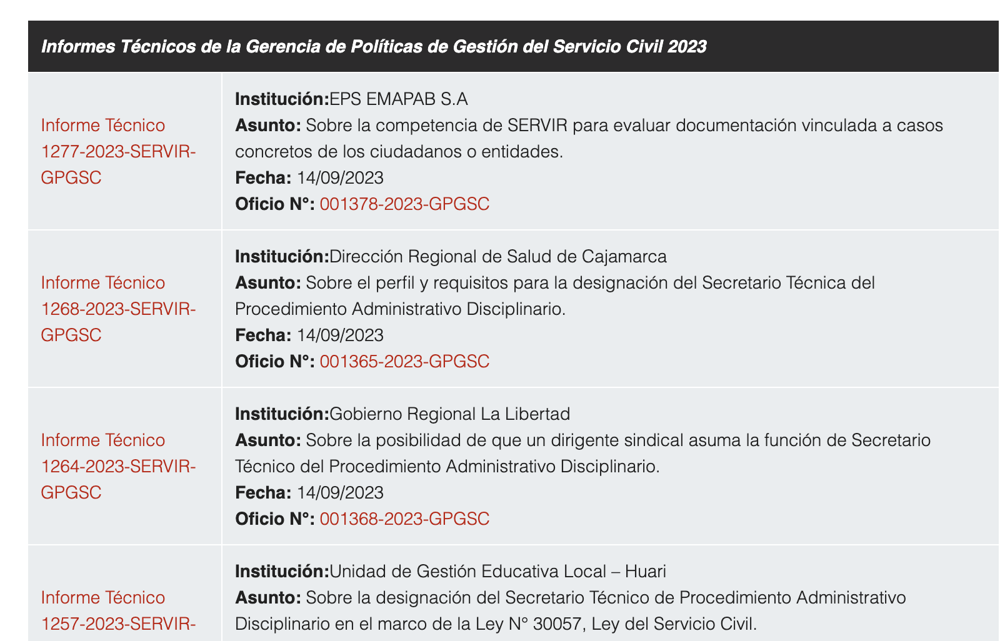

# Scrapping Servir page

This repo contains the python code to extract data from the [Servir](https://www.servir.gob.pe/rectoria/informes-legales/listado-de-informes-legales/) page. 

# Data Assets

The metadata is extracted and save in BigQuery. The data is available in the following table: Servir.InformesLegales.

The pdf files are saved in a cloud storage bucket: gs://servir-informes-legales.

* All the data assets are in spanish because of the data itseld is in spanish.(bucket, table, etc.). The code is completely in english.

# Metadata extraction



The table should contain the following columns:

column | description
--- | ---
informe | Informe Técnico 1277-2023-SERVIR-GPGSC
informe_url | https://storage.servir.gob.pe/normatividad/Informes_Legales/2023/IT_1277-2023-SERVIR-GPGSC.pdf
informe_gcs | gs://servir-informes-legales/2023/informe/it-1277-2023-SERVIR-GPGSC.pdf
institucion | EPS EMAPAB S.A
asunto | Sobre la competencia de SERVIR para evaluar documentación vinculada a casos concretos de los ciudadanos o entidades.
fecha | 14/09/2023
oficio | 001378-2023-GPGSC
oficio_url | https://storage.servir.gob.pe/normatividad/Informes_Legales/2023/Oficios/OF-001378-2023-GPGSC.pdf
oficio_gcs | gs://servir-informes-legales/2023/oficio/of-001378-2023-GPGSC.pdf

## Scripts description

2 files to run. The first one is to extract the data from a whole year and the second one is to extract the data from the last date of data in BigQuery to the current date.

Each file has a section if __name__: "__main__" to run the script.

The code uses selenium to scrape the data.

### year.py

1. Given a year:
    1. it extracts the metadata.
    2. Upload the pdf files (from whole year) to a cloud storage bucket
    3. Upload the metadata to BigQuery.

### daily.py

2. Incremental Load:
    1. get the last date of data in BigQuery.
    2. In the same year of the last date, it extracts the metadata where the date is greater than the last date.
    3. Upload the pdf files to a cloud storage bucket
    4. Upload the metadata to BigQuery

### utils.py

Contains the helper functions to extract the metadata and upload it to BigQuery or to upload files to cloud storage.

## Setup

1. Create python environment.

```bash
python3 -m venv .venv
source .venv/bin/activate && pip install --upgrade pip && pip install --upgrade setuptools
pip install -r requirements.txt
```

2. Create partitioned table in BigQuery.

```bash
bq mk --table --time_partitioning_field fecha --time_partitioning_type DAY --schema servir_informe_legales.json Servir.InformesLegales
```